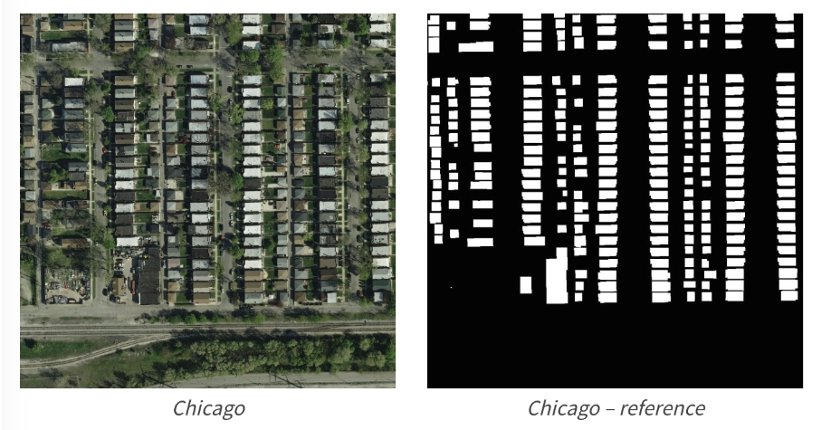
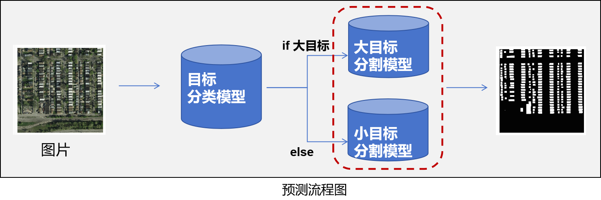
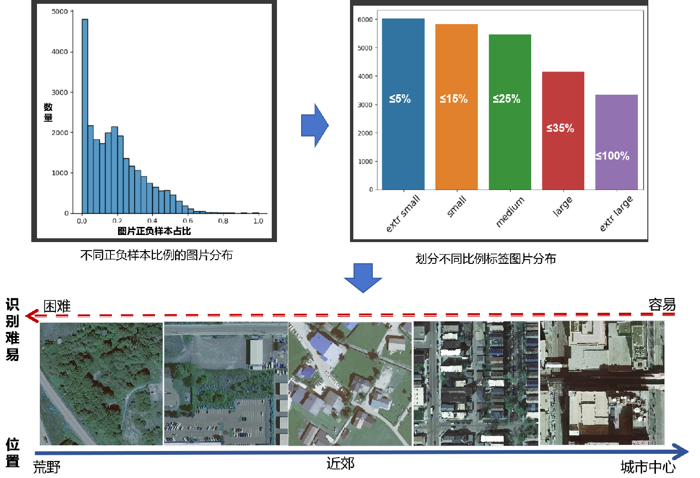
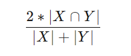

# 地表建筑识别方案介绍
## 一.背景
&emsp;&emsp;方案背景为[天池大数据语义分割入门长期赛-地表建筑物识别](https://tianchi.aliyun.com/competition/entrance/531872/information )，
要求基于航拍遥感图像数据，
识别地表建筑物，并将地表航拍图像素划分为有建筑物和无建筑物两类，属于典型二分类语义分割问题。
如下图，左边为原始航拍图，右边为对应的建筑物标注。 
  
## 二.方案介绍
&emsp;&emsp;本方案主要搭建了一个两阶段模型，第一阶段主要针对航拍场景进行大小目标分类，
第二阶段针对不同类别单独训练分割模型。在测试阶段，一张图片首先进入分类模型，划分目标大小类别，然后根据目标类别进入相应的分割模型，最后输出分割结果，基本流程如下图所示。
  

第一阶段分类模型主要解决大小目标图片分割效果差异大的问题。分析遥感图片发现，对于不同的场景，目标建筑（群）的大小差别很大，导致
图片的正负样本比例存在明显区别，采用一个模型一视同仁地分割会导致小目标的识别非常不理想。整理图片训练集正负样本比例，并通过经验分析对应场景如下图，分类建模根据以下信息进行标签构造。
 

&emsp;&emsp;第二阶段分别对大小目标进行分割模型选型并训练， 主要在数据预处理、数据增强、损失函数、模型融合及后处理方法做了一些工作，当前可达到的效果为:  

|  &emsp;&emsp;&emsp;&emsp;&emsp;&emsp;&emsp;&emsp;指标&emsp;&emsp;&emsp;&emsp;&emsp;&emsp;&emsp;&emsp; |   &emsp;&emsp;&emsp;&emsp;&emsp;&emsp;&emsp;&emsp;数值&emsp;&emsp;&emsp;&emsp;&emsp;&emsp;&emsp;&emsp;   |  
| :----:    |    :----: |  
| 训练dice  |   0.92  |  
| 验证dice  |   0.89  |  
| 测试dice  |   0.88  | 
| 当前排名   |  100/4K+ |

>补充: 评价指标dice计算方式:  
> 赛题使用Dice coefficient来衡量选手结果与真实标签的差异性，Dice coefficient可以按像素差异性来比较结果的差异性，具体计算方式如下:  
> &emsp;&emsp;&emsp;&emsp;&emsp;&emsp;&emsp;&emsp;&emsp;  
> 其中X是预测结果，Y为真实标签的结果。当X与Y完全相同时Dice coefficient为1，排行榜使用所有测试集图片的平均Dice coefficient来衡量，分数值越大越好。

## 三.第一阶段分类模型
&emsp;&emsp;在训练资源有限的情况下，方案简单地将图片划分两类，正负样本比例小于15%的图片划分为0类，比例大于15%的图片划分为1类，分别表示范乡村和范城市两个场景；
进一步，尝试了Resnet、VGG、GoogleNet的分类网络，Resnet34的分类网络对于两类样本的precision和recall指标能达到0.91左右，更深层的网络不会带来更好的效果；
在VGG16的基础上，给激活函数前添加BN层可以将效果提升到0.93，但网络结构非常大，训练慢。GoogleNet效果在0.92，参数少，收敛快。
最后网络选择VGG16_BN与GoogleNet进行集成。
&emsp;&emsp;损失函数采用BCELoss，同时在训练阶段增加了图像增强操作，并在预测阶段采用TTA的策略减小过拟合风险，训练前期TTA效果与无TTA效果差异波动大，在训练后期两者波动明显减小并趋于稳定。
|  &emsp;&emsp;&emsp;&emsp;&emsp;&emsp;&emsp;&emsp;模型&emsp;&emsp;&emsp;&emsp;&emsp;&emsp;&emsp;&emsp; |   &emsp;&emsp;&emsp;&emsp;&emsp;&emsp;&emsp;&emsp;各类别平均(precision+recall)/2&emsp;&emsp;&emsp;&emsp;&emsp;&emsp;&emsp;&emsp;   |  
| :----:    |    :----: |  
| VGG16_BN  |   0.93  |  
| GoogleNet  |   0.92  |  
| Resnet34  |   0.91  | 

## 四.第二阶段分割模型
&emsp;&emsp;搭建二阶段分割模型，确定大小目标图片合适的模型后，进行数据预处理、数据增强和损失函数
的设计，训练多个模型，并在最后预测进行模型融合以及TTA。

### 4.1 模型选型
&emsp;&emsp;对于大目标，主要尝试了一些经典的语义分割模型FCN、Unet、Unet++、DeeplabV3等融合结构，
backbone主要尝试了经典的Resnet18~152、更轻量的efficentnet家族、yolov3的darknet等。 
实验多次发现基于Unet和Unet++的经典结构，加上Resnet34的backbone可以实现较好的效果(验证dice>0.92)。
分析FCN的权值相加的融合方式及特征融合复杂度无法实现Unet类的丰富性；DeeplabV3的ASPP模块可能对建筑语物在空间特征的连续性出现了过度提取。
对于网络的搭建主要调用segmentation_models_pytorch库，能够快速完成模型的选项及主要结构的调整。
```python
# segmentation_models_pytorch主要代码如下:
import segmentation_models_pytorch as smp
model = smp.UnetPlusPlus(encoder_name='resnet50',
                         encoder_weights='imagenet',
                         in_channels=3,
                         classes=1)
# pre_model_path = None
pre_model_path = r'unet2_k0_resnet50.pth'
if pre_model_path is not None:
    model.load_state_dict(torch.load(pre_model_path))
model = model.to(device)
```
&emsp;&emsp;对于小目标模型，选择backbone选择EfficientNet-b4融合层选择Unet，验证dice在0.88左右。
同时微调2018年ICCV会议上用于图像的超分辨率重建的UHRNet结构，用于该小目标检测效果可以到达dice=**；
fragNet GatedNet

### 4.2 图片预处理
&emsp;&emsp;在数据预处理上，主要对数据进行进行标准化，将每个通道的pixel的数值归一到[-1,1]，加快模型训练的收敛。  
需要注意的是，ToTensor()后img三个通道的RGB数值会放缩到[0,1],进一步统计数据集所有图片的每个通道的均值和标准差可以得到Normalize中的系数。
```python
fixed_compose = transforms.Compose([transforms.ToPILImage(),
                                    transforms.Resize(512),
                                    transforms.ToTensor(),
                                    transforms.Normalize([0.4207, 0.4381, 0.4023],
                                                         [0.1831, 0.1678, 0.1600])])
```
### 4.3 图片增强
&emsp;&emsp;为了降低过拟合风险，采用数据增强扩展数据的代表性。在训练时对传入图像前进行了随机处理，
主要使用了albumentations库对image和mask标签进行处理，主要包括随机翻转、旋转、椒盐、灰度对比度和亮度调整，可用有效提高测试过程的dice系数。
```python
# 随机数据增强模块
import albumentations as abm
img_size = 512
randm_compose = abm.Compose(
                    [abm.HorizontalFlip(p=0.3),
                    abm.VerticalFlip(p=0.3),
                    abm.RandomRotate90(),
                    abm.PixelDropout(dropout_prob=0.01,
                                     per_channel=False,
                                     drop_value=0,
                                     mask_drop_value=None,
                                     always_apply=False, p=0.1),
                    abm.OneOf([
                        abm.Compose([abm.RandomCrop(int(img_size / 2), int(img_size / 2)),
                                     abm.Resize(img_size, img_size)], p=1),  # 随机裁剪 --> resize原来大小
                        abm.RandomGamma(gamma_limit=(60, 220), eps=None,
                                        always_apply=False, p=0.5),
                        abm.ColorJitter(brightness=0.07, contrast=0.1,
                                        saturation=0.2, hue=0.15,
                                        always_apply=False, p=0.3)])], p=0.3)
```
### 4.4 损失函数
&emsp;&emsp;统计每个图片中正类与负类样本比例大致在1:4，存在一定程度的样本失衡，
因此在BCE loss损失函数的基础上尝试加入DiCE loss、DiCE loss with log、Forcal loss等平衡项,
经过一些实验后发现，前期以`0.8 * BCE loss + 0.2 * DiCE loss`的方式将模型的dice训练到0.87以上后
采用`0.8 * BCE loss(正类权重=4) - 0.2 * log(1 - DiCE loss)`，并以较小的学习率微调可以进一步提升训练dice效果(大目标模型>0.93),
前期若直接以该损失训练会出现训练不稳定的问题，推测后期当模型比较准确了，统一两者的分布尺度有利于精细分类。
加入Forcal loss或调整BCE loss的权重对于评价指标的提升不是很明显，由于资源原因没有再做更多的尝试。
```python
"""
自定义损失函数
"""
class SoftDiceLoss(nn.Module):
    def __init__(self, smooth=0.001, dims=(-2, -1)):
        super(SoftDiceLoss, self).__init__()
        self.smooth = smooth
        self.dims = dims

    def forward(self, x, y):
        tp = (x * y).sum(self.dims)
        fp = (x * (1 - y)).sum(self.dims)
        fn = ((1 - x) * y).sum(self.dims)

        # dc = (2 * tp + self.smooth) / (2 * tp + fp + fn + self.smooth)
        dc = (2 * tp) / (2 * tp + fp + fn + self.smooth)
        dc = dc.mean()
        return dc
bce_fn = nn.BCEWithLogitsLoss() # 正:负 = 4:1
dice_fn = SoftDiceLoss()
bce_fn.to(device)
dice_fn.to(device)
def loss_fn(y_pred,
            y_true,
            ratio=0.8,
            log_dic=False):
    """
    损失函数构建
    """
    bce = bce_fn(y_pred, y_true)
    dice = dice_fn(y_pred.sigmoid(), y_true)
    return ratio*bce + (1-ratio) * (1 - dice)

### TODO 当验证dice>0.87后采用以下损失函数
bce_fn = nn.BCEWithLogitsLoss(pos_weight=torch.tensor(0.8)) # 正:负 = 4:1
dice_fn = SoftDiceLoss()
bce_fn.to(device)
dice_fn.to(device)
def loss_fn(y_pred,
            y_true,
            ratio=0.8,
            log_dic=True):
    """
    损失函数构建
    """
    bce = bce_fn(y_pred, y_true)
    dice = dice_fn(y_pred.sigmoid(), y_true)
    if log_dic:
        return ratio*bce + (1-ratio) * (-torch.log2(dice))
    else:
        return ratio*bce + (1-ratio) * (1 - dice)
```

### 4.5 模型融合及后处理方法
&emsp;&emsp;模型融合方法主要采用了k折训练+多模型bagging；后处理法方法主要采用了TTA(Test Time Augmentation)，简单噪点过滤。  
方案主要的搭配方式为: 
训练时
1. 小样本训练确定效果不错的模型  
2. 对每类模型进行k折训练得到k个模型，记录每类模型的dice均值作为加权系数 
预测时
3. 每类模型结构的k个模型进行预测，取k个结果的均值，每类模型得到一个预测结果
4. 每类模型的预测结果按照平均dice的比例进行加权得到最终结果
5. 使用TTA的方式重复3、4部生成多个预测结果并进行概率平均最为最终图片的模型结果
6. 最后使用简单的中值滤波+高斯滤波去噪点；
***
以上涉及一些关键代码模块如下：  
训练集进行k折划分，依次每一折作为验证集，其余作为训练集，训练得到k组模型参数
```python
from sklearn.model_selection import KFold
k_split = 4 # 划分k折
k_train = 0 # 取第几折划分的训练集验证集
dataset0 = MyData(img_path, mask_info,
                 fixed_compose=fixed_compose,
                 randm_compose=randm_compose)
dataset1 = MyData(img_path, mask_info,
                 fixed_compose=fixed_compose) # 抽取验证集

kfold = KFold(n_splits=k_split,
              shuffle=True,
              random_state=2023)
kfold_split = kfold.split(mask_info.index,
                          mask_info.index)

for k, (train_idx, valid_idx) in enumerate(kfold_split):
    if k == k_train:
        train_set, valid_set = Subset(dataset0, train_idx), Subset(dataset1, valid_idx)

        train_loader = DataLoader(train_set,
                                  batch_size=batch_size,
                                  drop_last=True,
                                  num_workers=0)
        valid_loader = DataLoader(valid_set,
                                  batch_size=batch_size,
                                  drop_last=True,
                                  num_workers=0)
        break
```
***
多模型结果bagging和voting
```python
def bagaing(masks, threshold=0.5, method='voting'):
    """
    对多个模型结果进行Bagging, 采用均值概率or投票
    :param masks: 输入的所有模型预测结果 
                  tensor([model_nums, h, w])
                  or list(mask1,mask2,...)
    :return:
    """
    if isinstance(masks, list):
        masks = torch.concat(masks)

    if method == 'voting': # 硬投票
        masks = masks >= threshold
        masks = masks + 0
        mask = masks.sum(0) / masks.shape[0] > 0.5001
        return mask + 0
    else:
        # 返回概率均值
        masks = masks.sum(0) / masks.shape[0] >= threshold
        return masks + 0
```
***
TTA主要采用了一些竖直翻转、水平翻转、90度旋转、灰度亮度对比度渲染，
需要注意的是对于存在空间变换的操作需要以一个逆操作将结果恢复到原来的空间关系。
```python
def TTA(imgs, model):
    """
    在测试模块对一个batch进行多图像增强
    对同一个图获得多个预测[mask1, mask2, mask3, ...]
    融合：mask = (mask1 + mask2 + mask3 + ...) / n
    图像增强：水平翻转、竖直翻转、 旋转、对比度灰度
    """
    model.eval()
    with torch.no_grad():
        vflip = transforms.RandomVerticalFlip(p=1)
        hflip = transforms.RandomHorizontalFlip(p=1)
        rota_90 = transforms.RandomRotation((90, 90))
        rota_90ab = transforms.RandomRotation((-90, -90))
        jiter = transforms.ColorJitter(brightness=0.1, contrast=0.1, saturation=0.2, hue=0.15)
        mask1 = torch.sigmoid(model(imgs))
        # 翻转
        mask2 = torch.sigmoid(vflip(model(vflip(imgs))))
        mask3 = torch.sigmoid(hflip(model(hflip(imgs))))
        # 旋转
        mask4 = torch.sigmoid(rota_90ab(model(rota_90(imgs))))
        mask5 = torch.sigmoid(rota_90(model(rota_90ab(imgs))))
        # 灰度对比度
        mask6 = torch.sigmoid(model(jiter(imgs)))
    return (mask1 + mask2 + mask3 + mask4 + mask5 + mask6) / 6
```
***
基于图形形态的后处理方法主要使用了cv2里面的中值滤波、高斯滤波去噪点、 腐蚀后膨胀提高边缘清晰度、孤立团替换，
`最后结果只使用简单的滤波，其他方式会使得效果有明显下降，推测为模型准确率已经较好`
```python
# open cv后处理
def remove_noise(mask, filter='Gaussian',
                 erode_dilate=True,
                 post_area_threshold=25,
                 post_length_threshold=25):
    """
    中值滤波、高斯滤波去噪点、腐蚀后膨胀提高边缘清晰度、孤立团用左像素替换
    :param mask: 预测结果 mask-1 , background-0
    :return:
    """
    if not isinstance(mask, np.ndarray):
        mask = np.asarray(mask, dtype=np.uint8)
    if erode_dilate:
        kernel = np.ones((5, 5), np.uint8)
        mask = cv2.morphologyEx(mask, cv2.MORPH_OPEN, kernel)
    if filter == 'Gaussion':
        mask = cv2.GaussianBlur(mask, 5, 0)
    else:
        mask = cv2.medianBlur(mask, 5)

    mask_ = mask.copy()
    contours, hierarch = cv2.findContours(mask_, cv2.RETR_EXTERNAL, cv2.CHAIN_APPROX_NONE)
    for i in range(len(contours)):
        area = cv2.contourArea(contours[i])
        length = cv2.arcLength(contours[i], True)
        if area <= post_area_threshold or length <= post_length_threshold:
            cnt = contours[i]
            # 左顶点
            location = tuple(cnt[cnt[:, :, 0].argmin()][0])
            class_num = int(mask[location[1], location[0] - 1])
            cv2.drawContours(mask, [cnt], 0, class_num, -1)
    return mask
```
### 4.6 分割效果展示

好的图

一般的图

滤波的对比图

## 五.总结与思考
**总结**：
从预测结果上看，模型对于一些模糊的小目标检测能力弱，可以尝试在数据预处理增加对边缘轮廓的锐化，在数据增强上增大随机剪裁放大的比例，
有余力可在训练过程中进行多尺度训练。
在模型结果选择上发现resnet34作为backbone效果比resnet50、101等效果要好很多，resnet34的残差层模块参数更多，
带来的感受野更丰富；
难分样本boosting的方式可能存在泛化能力下降的风险，方案只用到一种多折交叉检验确定超参的方法进行控制

**其他尝试**：
可以进一步尝试微调Darknet的模型家族，尝试金字塔结构的高低特征融合策略
后处理探索CRF(条件随机场)，因为建筑分布集中，边缘与背景存在较为明显的分界，推测效果应该可以改善一些

**其他比赛**
语义分割进阶
缺陷识别


**分割线**
***
---
